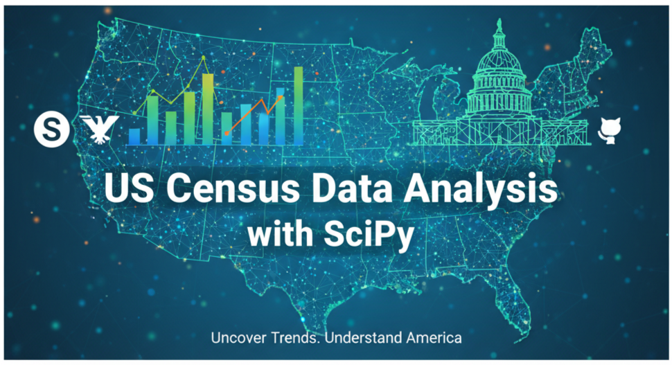

# us_census_data_analysis_with_scipy

# Uncovering America's Story: A SciPy-Powered US Census Data Analysis 📊

This project utilizes **SciPy** for an in-depth numerical and statistical analysis of US Census data. The primary objective is to move beyond raw demographic figures and employment statistics to extract meaningful insights into population trends, economic distributions, and societal shifts across the United States.

## 🎯 Project Goal
To apply SciPy's advanced mathematical and statistical functions to US Census data to identify underlying patterns, test hypotheses, and model demographic and economic phenomena.

## 🔍 Key Questions & Analyses
- **Population Dynamics:** How have population growth rates varied across states or regions over time, and what statistical distributions best describe these changes?
- **Economic Disparities:** Can we use SciPy's optimization or statistical tools to identify and quantify income distribution disparities across different demographic groups or geographic areas?
- **Socio-Economic Correlations:** What are the significant correlations between educational attainment, employment rates, and other socio-economic indicators, as revealed by SciPy's correlation and regression capabilities?
- **Time-Series Forecasting:** Can we build predictive models for future demographic trends (e.g., aging populations, migration patterns) using SciPy's signal processing or interpolation functions?

## 💡 A Key Insight
Preliminary analysis often reveals that **population density and median income** exhibit complex, non-linear relationships that can be better modeled using SciPy's curve fitting and optimization routines than simple linear regressions, suggesting nuanced interactions between geographic factors and economic prosperity.

## 🛠️ Tech Stack
- **Numerical & Statistical Analysis:** SciPy
- **Data Manipulation:** Pandas, Numpy
- **Environment:** Jupyter Notebook
